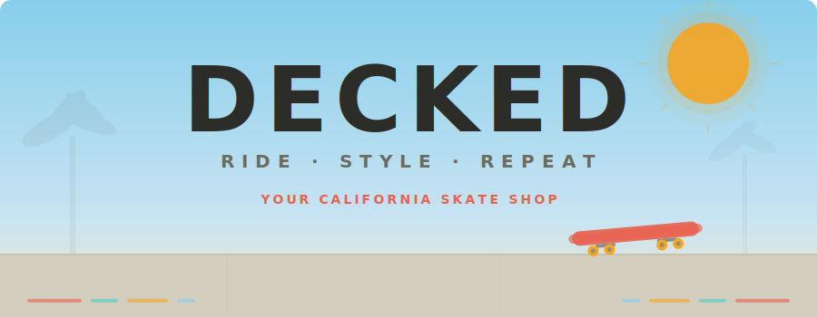
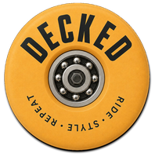
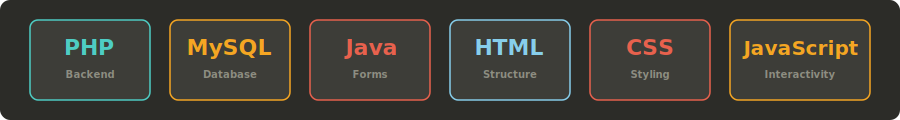
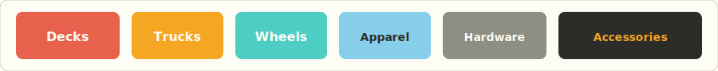

<p align="center">
  
</p>

<p align="center">
  
</p>

<p align="center">
  <strong>A fully functional skate shop built from scratch.</strong><br/>
  School project for the <em>Systems Integration</em> module at ISLA Gaia - turned into something worth showing off.
</p>

<p align="center">
  
  
  
</p>

---

## 🛹 What is DECKED?

DECKED is a California surf-skate inspired online skate shop. Not just a classroom exercise - it's a fully styled, fully functional e-commerce site with authentication, a product catalogue, shopping cart, order history, and an admin panel. Everything from the logo to the product descriptions is custom-built with a consistent brand identity.

This repo hosts the **portfolio version** - a static front-end that runs on GitHub Pages using JavaScript and localStorage to simulate the full shopping experience. The school version runs on PHP + MySQL via XAMPP.

## ⚡ Tech stack

<p align="center">
  
</p>

| Layer | School version | Portfolio version |
|-------|---------------|-------------------|
| **Backend** | PHP 8 + Apache (XAMPP) | - |
| **Database** | MySQL | localStorage (JSON) |
| **Forms** | Java (NetBeans 22) | JavaScript |
| **Frontend** | HTML + CSS + JS | HTML + CSS + JS |
| **Styling** | Vanilla CSS (fully responsive) | Same stylesheet |
| **Editor** | VS Code + NetBeans | VS Code |

## 🏪 Product categories

<p align="center">
  
</p>

6 categories, 6-8 products each - enough to feel like a real shop:

- **Decks** - The core. Custom DECKED graphics, various sizes and concaves.
- **Trucks** - From street-tight to loose cruiser setups.
- **Wheels** - Different durometers for different terrain.
- **Apparel** - Tees, hoodies, and caps with DECKED branding.
- **Hardware** - Bolts, risers, tools. The stuff that holds it all together.
- **Accessories** - Bags, stickers, wax. The extras that complete the kit.

## 🎨 Design direction

**Visual identity:** California surf-skate culture - warm, bold, street-friendly. Think golden hour at a Venice Beach skatepark, not a dark corporate storefront.

**Typography:**
- **Headings:** Passion One (condensed, bold, punchy)
- **Body:** Quicksand (rounded, warm, readable)

**Colour palette:**

| Colour | Hex | Role |
|--------|-----|------|
| 🔵 Sky Blue | `#87CEEB` | Primary - headers, nav, links |
| 🟡 Sandy Gold | `#F7E8C8` | Secondary - page bg, card fills |
| 🔴 Coral Red | `#E8614D` | Accent - CTAs, prices, badges |
| 🟢 Seafoam | `#4ECDC4` | Accent - tags, secondary buttons |
| 🟠 Sunset Orange | `#F5A623` | Accent - highlights, sale tags |
| ⚫ Concrete | `#8E8E82` | Neutral - borders, muted text |
| ⬜ Cream White | `#FEFDF5` | Page background |
| ⬛ Dark Coal | `#2C2C28` | Headings, footer |

## ✨ Features

### Core (required by module)
- [x] User registration and login
- [x] Session management with logout
- [ ] Product browsing by category
- [ ] Product detail pages
- [ ] Shopping cart
- [ ] Order history
- [ ] Admin panel (CRUD products, manage users, view orders)

### Planned
- [ ] Featured products on homepage
- [ ] Stock management (In Stock / Low Stock / Out of Stock)
- [ ] Filtered search (by category, price, etc.)
- [ ] Wishlist / favourites
- [ ] Fully responsive across all devices

### Portfolio version (GitHub Pages)
- [ ] localStorage-powered cart
- [ ] Fake login/registration (browser-only)
- [ ] JSON-based product catalogue
- [ ] Order history (localStorage)
- [ ] All the visual polish, none of the server

## 📄 Pages

| Page | School | Portfolio |
|------|--------|-----------|
| Homepage (hero + featured products) | ✅ | ✅ |
| Product catalogue (by category) | ✅ | ✅ |
| Product detail | ✅ | ✅ |
| Cart | ✅ | ✅ (localStorage) |
| Login / Register | ✅ | ✅ (localStorage) |
| User area (profile, orders) | ✅ | ✅ (localStorage) |
| Admin panel | ✅ | ❌ |
| About | ✅ | ✅ |
| Contact | ✅ | ✅ |

## 🚧 Roadmap

This project is being built alongside the school module. Features land here as they're completed in class and styled for the portfolio.

```
 ██████░░░░░░░░░░░░░░  ~30% complete
```

**Done:** Auth flow (login, register, logout, session), logo, brand identity, colour system, typography, project structure.

**Next:** Product database, category pages, product detail pages, CSS styling pass.

**Later:** Cart, orders, admin panel, search, wishlist, responsive polish.

## 📁 Project structure

```
decked/
├── assets/
│   ├── decked-banner.svg
│   ├── decked-stack.svg
│   ├── decked-categories.svg
│   ├── decked-logo-full.png
│   ├── decked-logo-hero.png
│   ├── decked-logo-footer.png
│   ├── decked-logo-navbar.png
│   ├── decked-favicon-32.png
│   └── decked-favicon.ico
├── css/
│   └── style.css
├── js/
│   └── (coming soon)
├── img/
│   └── products/ (coming soon)
├── index.html
├── about.html
├── contact.html
└── README.md
```

## 🤙 About

Built by [Tiago](https://bytiago.com) as part of the Systems Integration module at ISLA Gaia.

The brand, design, and front-end are original work. The backend follows the module's PHP + MySQL curriculum. The California sun is optional but recommended.

---

<p align="center">
  
  <br/>
  <sub>DECKED © 2026 · Ride. Style. Repeat.</sub>
</p>
