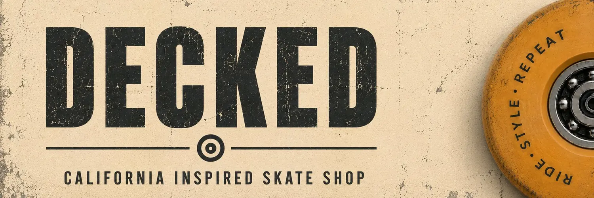
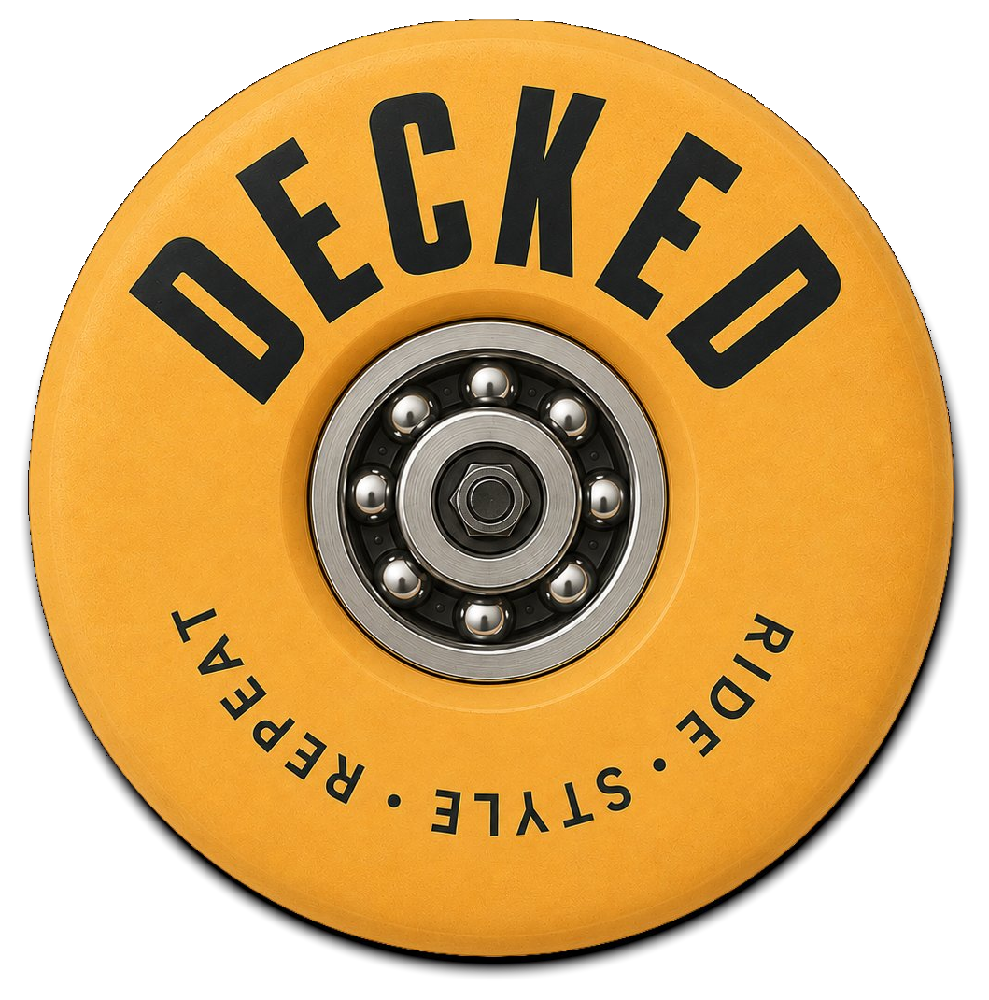

  

  
  
  

---

DECKED is a fictional skate and lifestyle brand built from scratch.

While many skate shops lean into darker, urban aesthetics, DECKED explores a different direction. Inspired by California surf culture, the project focuses on warm colours, relaxed energy, and a more welcoming visual identity while still staying rooted in skateboarding.

Everything in the store was created specifically for the project, including the branding, product catalogue, product descriptions, photography direction, and overall user experience.

## Approach

The goal was to build something that feels less like a frontend exercise and more like a real brand.

Rather than starting with features, I started with identity. The colour palette, typography, product categories, promotional content, and page layouts were all designed around a consistent California-inspired aesthetic that carries through the entire experience.

## Design

### Typography

* Archivo
* Instrument Serif
* Spline Sans Mono

### Colour palette

| Colour        | Hex       | Role                            |
| ------------- | --------- | ------------------------------- |
| Cream White   | `#FEFDF5` | Page background                 |
| Sandy Gold    | `#F7E8C8` | Secondary surfaces              |
| Coral Red     | `#E8614D` | Accents and pricing             |
| Seafoam       | `#4ECDC4` | Primary actions                 |
| Sunset Orange | `#F5A623` | Highlights and stock indicators |
| Concrete      | `#8E8E82` | Muted content                   |
| Dark Coal     | `#2C2C28` | Primary text and navigation     |

## Project highlights

* 42 custom products across six categories
* Product catalogue, cart, checkout, and account flows
* Responsive layouts for desktop, tablet, and mobile
* User authentication and order history using localStorage
* Original brand identity and custom-written product content

## Tech stack

| Layer    | Implementation          |
| -------- | ----------------------- |
| Frontend | HTML + CSS + JavaScript |
| Data     | localStorage            |
| Hosting  | GitHub Pages            |

---

  
   
  DECKED &copy; 2026

