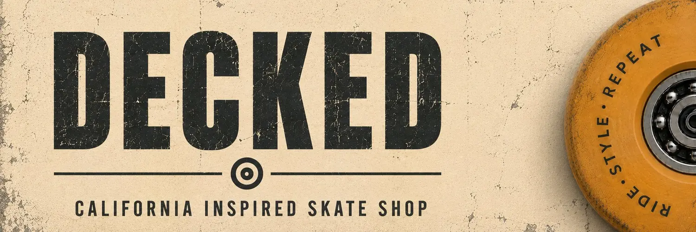
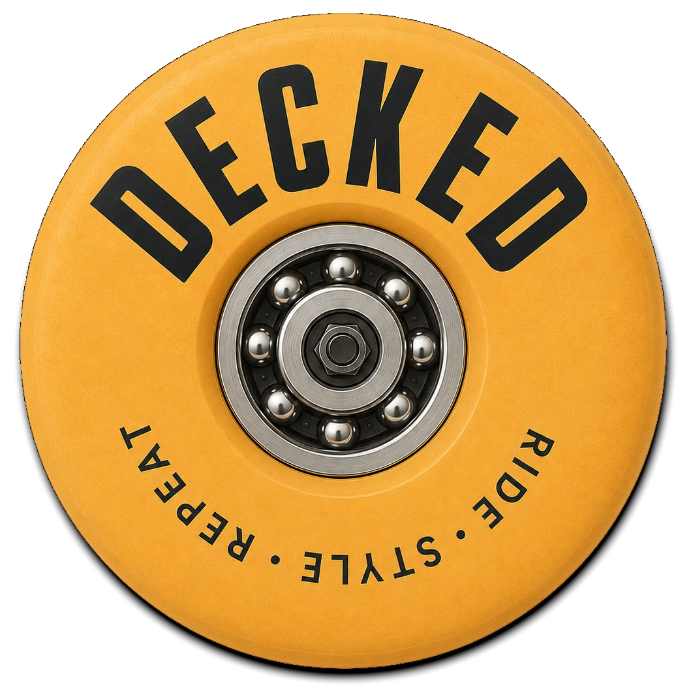

  

---

DECKED is a fictional skate and lifestyle brand. I built it to practice creating complex e-commerce flows without actually writing any backend code. The goal was to see how much of a real store I could simulate using only static files and browser tools.

## Design

Instead of the dark, gritty look a lot of skate brands use, I went with a lighter California-inspired palette. The background is a cream white, with coral red for pricing and seafoam for primary buttons. For typography, I paired Archivo for headings, Instrument Serif for accents, and Spline Sans Mono for metadata and stock indicators.

## How it works

The site is built with plain HTML, CSS, and vanilla JavaScript. Since it is hosted as static files on GitHub Pages, there is no server or database. To make the cart, checkout, and user accounts work, I relied entirely on `localStorage`. 

Every product in the catalogue has an ID, and the cart just saves an array of those IDs and quantities. When you register or log in, it just saves a name locally. When you check out, it generates a fake order number, calculates shipping, and saves the receipt to the browser so it persists across page reloads. 

It is obviously not secure enough for a real store since anyone can open the developer tools and edit their cart, but it was a great way to practice sharing state across a multi-page vanilla JavaScript site.

## Live site

You can browse the shop and test the checkout flow on the [live demo](https://bytiagodev.github.io/decked/).

---

  
   
  DECKED &copy; 2026

